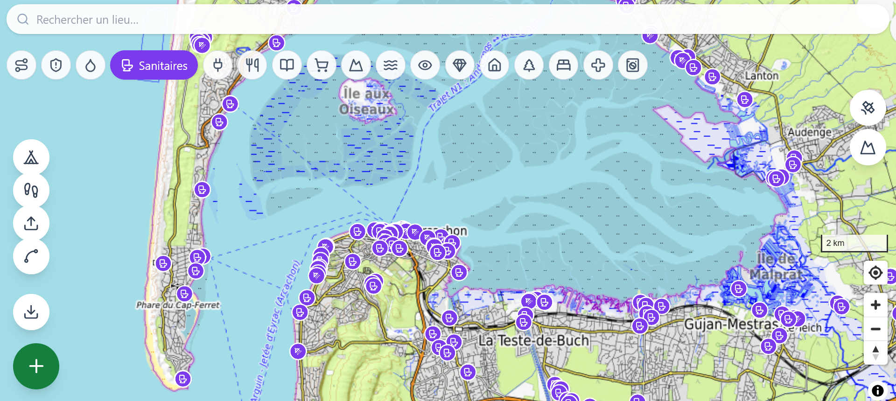

# Survival Map 🏕️

**PWA de rando & bivouac** — une carte topo qui marche **hors-ligne**, pour préparer une sortie et survivre en bivouac : points d'eau, abris, refuges, sommets, cascades, points de vue… plus tes **points perso** et tes **itinéraires** qui suivent les sentiers.

Couverture **France · Espagne · Italie**. Aucun compte, aucun backend : tout est local dans ton navigateur.



---

## ✨ Fonctionnalités

- 🗺️ **Carte topo** (OpenTopoMap : relief + courbes de niveau), vue **satellite** et **3D (relief)** en ligne.
- 💧 **Points d'intérêt OSM** filtrables : eau potable, fontaines, abris, toilettes, refuges, prises, tables de pique-nique, sommets, cascades, points de vue, boulangeries, cimetières, boîtes à livres…
- 🛡️ **Espaces protégés** (parcs, réserves) en surcouche.
- 🥾 **Sentiers & chemins** balisés (dont fiches **Geotrek**) cliquables, avec distance / D+ / durée estimée.
- ✏️ **Création d'itinéraire** qui suit les chemins (routing **BRouter**) — pose les étapes au doigt **ou pars de ta position GPS**, avec profil altimétrique en direct.
- 📍 **Points perso** (ex. « prise fiable mairie », « source fiable »), stockés en local.
- 👣 **Enregistrement de trace GPS** en direct + **import / export GPX**.
- ⛺ **Infos bivouac** : soleil (lever/coucher), lune (phase), et **météo 3 jours** (Open-Meteo).
- 📶 **Hors-ligne** : télécharge une zone (tuiles vectorielles) pour l'avoir sans réseau ; PWA installable sur mobile.

---

## 🧱 Stack

- **Vite + React 19 + TypeScript**
- **MapLibre GL JS** + **PMTiles** — tuiles vectorielles servies depuis **Cloudflare R2** (cf. *Données* ci-dessous)
- **Tailwind CSS** + **Lucide** icons
- **Dexie.js** (IndexedDB) — points & itinéraires perso, 100 % local
- **vite-plugin-pwa** — manifest + service worker (offline)
- Services externes gratuits sans clé : **BRouter** (itinéraires), **Open-Meteo** (météo), **suncalc** (soleil/lune)

---

## 🚀 Démarrage

```bash
npm install
npm run dev          # serveur de dev Vite
```

La carte s'ouvre centrée sur **Narbonne**. Active des catégories dans la barre du haut, déplace la carte, et utilise le bouton **+** pour ajouter un point perso. L'icône **Spline** ouvre le créateur d'itinéraire.

### Build & preview

```bash
npm run build        # tsc -b && vite build -> dist/
npm run preview
```

### Tests & lint

```bash
npm test             # vitest
npm run lint         # eslint
```

---

## 🗂️ Données

Les points d'intérêt, sentiers, chemins et espaces protégés sont pré-construits depuis **OpenStreetMap** (et **Geotrek** pour les fiches rando) en fichiers **PMTiles**, puis hébergés sur **Cloudflare R2** (trop volumineux pour le dépôt). Le client les lit directement via leurs URLs publiques `*.r2.dev`.

La (re)construction des PMTiles est automatisée par les workflows GitHub Actions (`.github/workflows/build-*.yml`). Les accès R2 d'écriture sont fournis via des **secrets GitHub** (`R2_ACCESS_KEY_ID`, `R2_SECRET_ACCESS_KEY`, `R2_ACCOUNT_ID`) — ils ne sont jamais stockés dans le dépôt.

---

## 📦 Déploiement

Pensé pour **Vercel** : framework auto-détecté (Vite), build `npm run build`, sortie `dist/`.

---

## 📄 Attribution & licences

Cette app affiche des données tierces dont l'**attribution est obligatoire** :

- Données cartographiques © **[OpenStreetMap](https://www.openstreetmap.org/copyright)** — licence **ODbL**
- Fond topo © **[OpenTopoMap](https://opentopomap.org)** — **CC-BY-SA**
- Imagerie satellite © **Esri World Imagery** (Esri, Maxar, …)
- Itinéraires via **[BRouter](https://brouter.de)** · météo via **[Open-Meteo](https://open-meteo.com)** · fiches **Geotrek**

Merci de conserver ces mentions dans toute redistribution.

---

> MVP local d'abord — pas de compte ni de serveur applicatif.
> Pistes : sync multi-appareils, profils de routing supplémentaires, couverture élargie.
